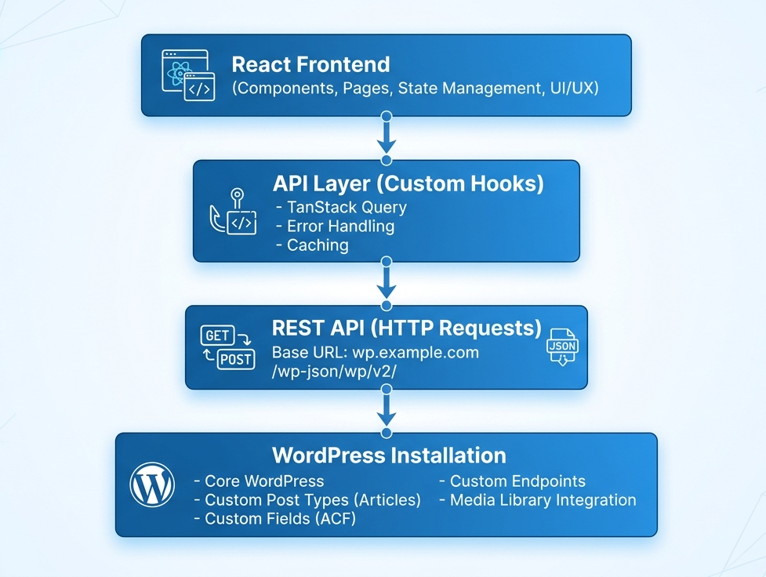
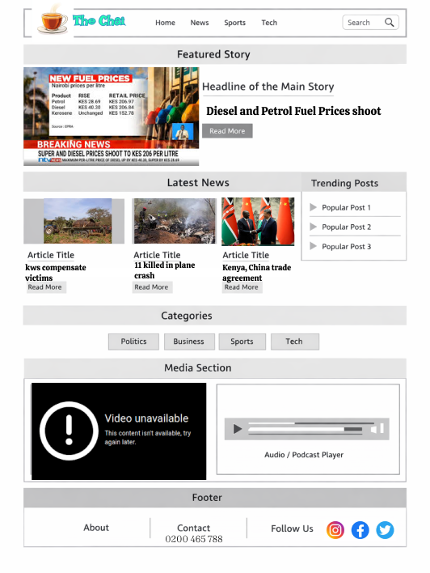

A content-driven news platform using React and a headless CMS (WordPress), focusing on content structuring, mobile optimization, and performance improvements. Implemented features like trending posts, category filtering, and responsive design.

## Project Overview
Frontend: React 18+ with TypeScript
Backend: WordPress 6.0+ as headless CMS
API: RESTful WordPress REST API v2
Styling: Tailwind CSS for rapid development
State Management: React Context API / TanStack Query

## Architectural Diagram

## UI Snapshot
